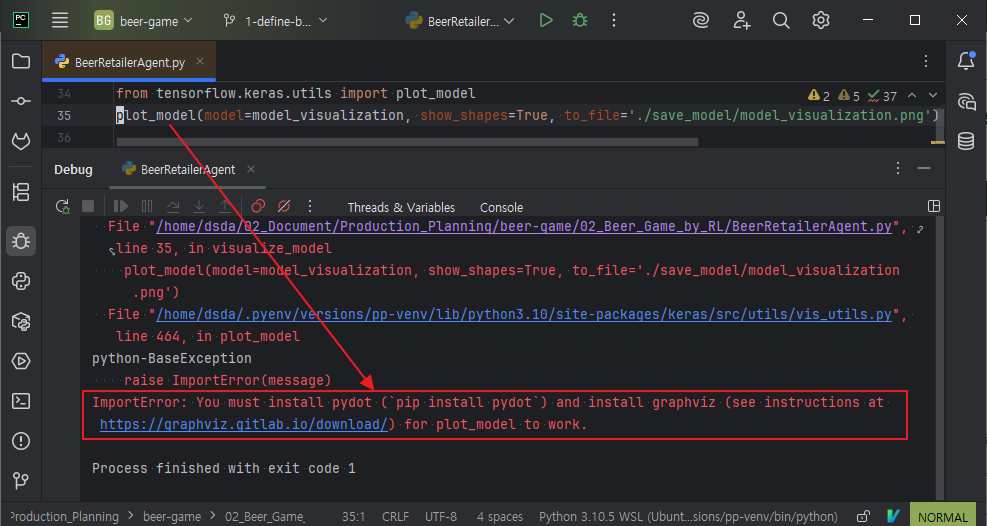

## Install graphviz python package with dependencies
```bash
$ pip install pydot pydotplus graphviz
```
## ImportError for graphviz


## Why this ImportError occur ?
```text
The python package graphviz is a wrapper.
So you need to install the original graphviz.
```

## Install graphviz on Ubuntu24 in order to solve the ImportError
```bash
$ sudo apt install graphviz
```
